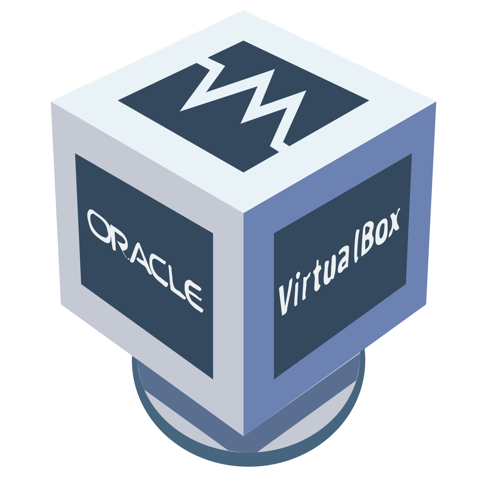

Documentation du logiciel Oracle VirtualBox
==========

## Introduction

Oracle VirtualBox est un logiciel libre et gratuit de virtualisation dont la première version a été publié le 15 janvier 2007.
La version actuelle est la version 7.0.20 sortie le 16 juillet 2024.

### Systèmes disponibles

VirtualBox est disponible sur :

* Linux (plusieur distributions)
* Windows et Windows Server
* Mac OS
* Solaris

Et il peut virtualiser :

* Linux (plusieur distributions)
* Windows et Windows Server
* Solaris

## Ajout d'une machine virtuelle

Il y a 2 manières d'ajouter une machine virtuelle avec VirtualBox :

* Pour créer une toute nouvelle machine virtuelle, appuyez sur le bouton **Nouvelle** ou faites **Ctrl + N**.
* Si vous possédez déjà une machine virtuelle sur votre ordinateur, appuyez sur le bouton **Ajouter** ou faites **Ctrl + A**.

### Création

* Etape 1 : Donner un nom à la nouvelle machine. Ce nom sera affiché dans la liste et utilisé dans les fichiers de l'ordinateur

* Etape 2 : Choisissez l'emplacement où la machine sera stockée sur l'ordinateur. Assurez-vous que l'emplacement possède assez d'espace pour contneir la machine virtuelle.

* Etape 3 : Sélectionnez le fichier .iso pour l'OS que vous souhaitez utiliser.

* Etape 4 : VirtualBox va détecter automatiquement le type et la version du fichier .iso mais vous pouvez tout de même les modifier.

* Etape 5 : Si le fichier .iso le permet, vous pouvez choisir de passer l'installation de l'OS. Dans ce cas, VirtualBox va vous demandez de remplir les informations de votre compte utilisateur. Sinon, l'installation se fera manuellement.

* Etape 6 : La machine virtuelle va avoir besoin de se voir attribué des ressources de votre ordinateur. Choisissez la RAM et le nombre de processeurs que vous souhaitez allouer à la machine.

* Etape 7 : Cliquez sur Suivant pour choisir un **disque dur virtuel**. Vous pouvez en créer un nouveau en cliquant sur l'option pour créer un nouveau disque dur en virtuel et en choisissant la taille du disque et le type d'image que vous souhaitez utiliser. Vous pouvez également en choisir un déjà créé.

Une fois toutes ces étapes réalisées, la VM sera créée et disponible pour le lancement.

### Lancement

Pour lancer une machine virtuelle, vous avez plusieurs choix :
* Double-cliquez sur le nom de la machine que vous voulez lancer dans la liste.
* Cliquez sur le nom de la machine et cliquez sur Démarrer tout en haut.
* Dans le dossier **VirtualsBox VMs**, trouvez le sous-dossier correspondant à votre machine virtuelle et exécutez le fichier avec l'extension .vbox.

**ATTENTION** Si vous lancez une machine pour la première fois, le processus d'installation de l'OS se lancera. Veuillez suivre les étapes qui s'afficheront pour finaliser l'installation.

### Quitter et enregistrement d'état

Pour quitter une machine virtuelle vous pouvez l'éteindre depuis l'OS de la machine ou bien vous pouvez fermer la fenêtre de VirtualBox. Si vous fermez la fenêtre, vous aurez le choix entre **Eteindre la machine** comme si vous la débranchiez, **Envoyer le signal d'extinction**, et **Enregistrer l'état de la machine** pour que la prochaine fois que vous allumez la VM, elle reviendra là où vous l'avez fermée.

Vous pouvez créer des **instantanés** à tout moment pour y revenir plus tard si il y a un problème.

Pour cela, lorsque votre VM est lancée, ouvrez sur le menu Machine et cliquez sur **Prendre un instantané**.
L'état de la machine enregistré dans l'instantanée correspond à celui au moment où vous avez pris l'instantané.

Pour restaurer un instantané, allez dans l'onglet **Instantanés**, sélectionner l'instanné souhaité et cliquez sur **Restaurer**.
En restaurant un instantané, vous perdez l'état actuel de votre machine et il est remis dans le même état que dans l'instantané.